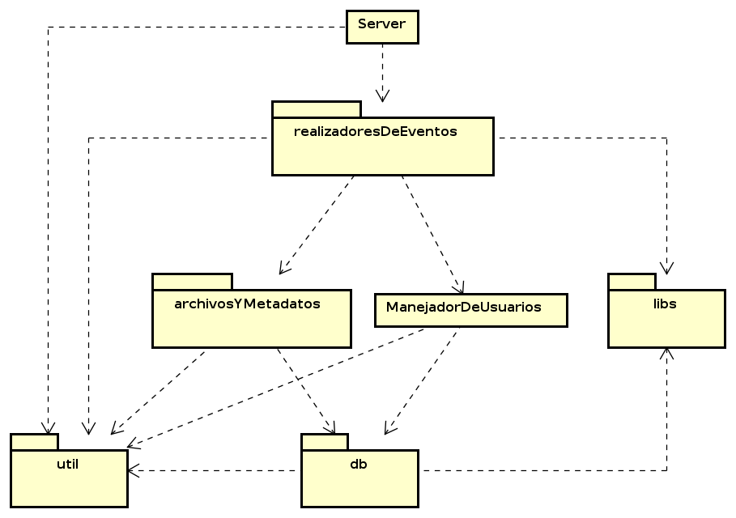
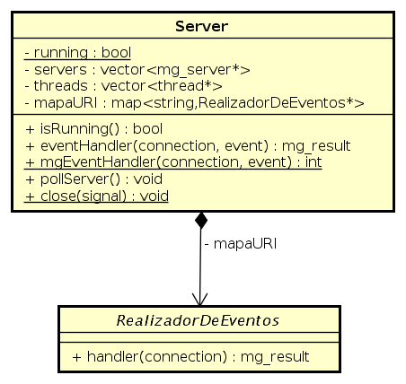
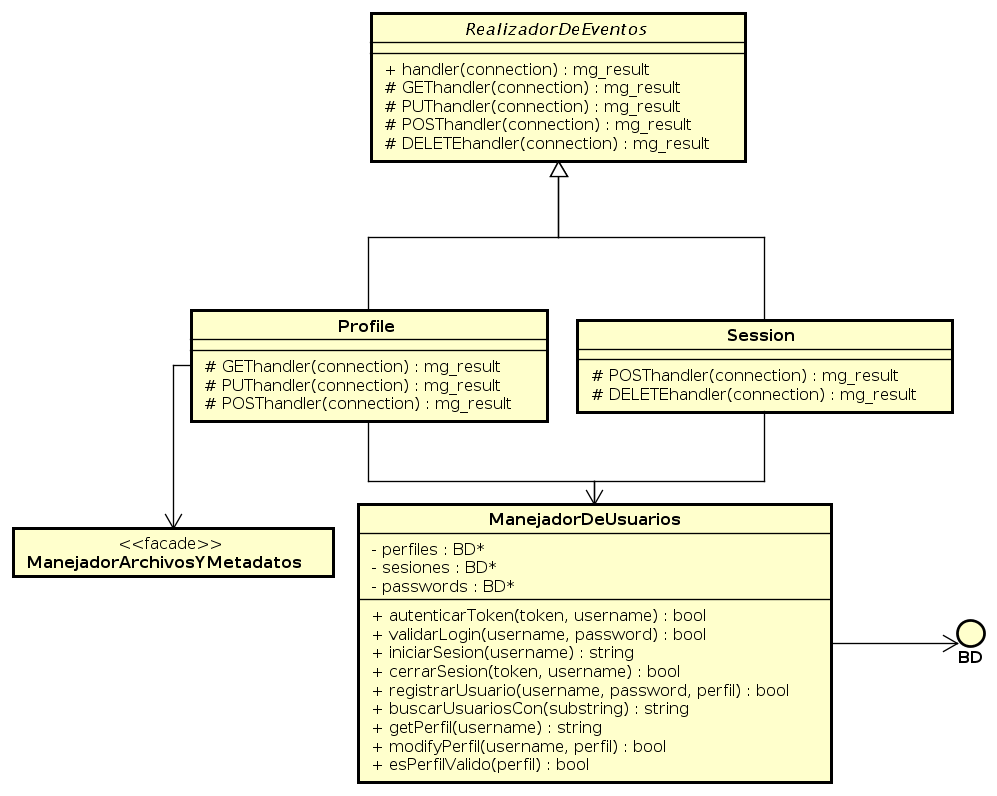
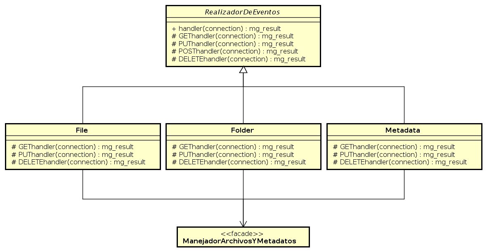
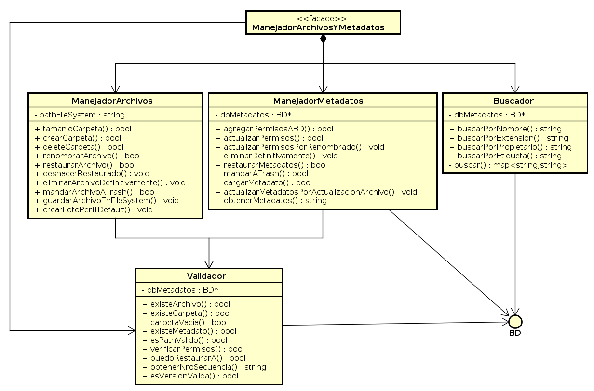
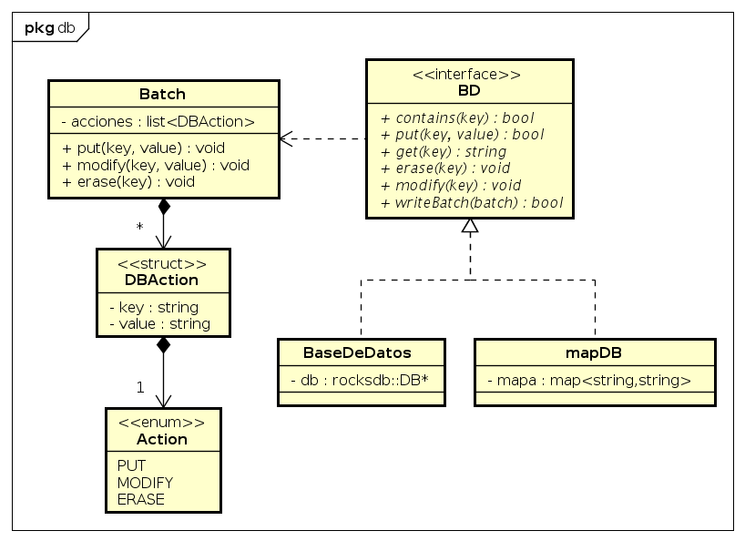

===============================================================================
Diseño y Clases
===============================================================================

Introducción
-------------------------------------------------------------------------------

Inicialmente, se planteó definir un servidor que se apoyara en dos manejadores, el de usuarios y el de archivos y metadatos. A su vez, los manejadores, en la medida que fuese necesario, se volverían el acceso a subsistemas más complejos que resolviesen el manejo de los datos correspondientes. Además, se plantearon distintos realizadores de eventos para resolver pedidos relacionados a distintos tipos de recursos. Se agruparon también ciertas clases utilitarias en un paquete de herramientas, y las librerías externas por otro lado.

Así se llegó al siguiente diseño de alto nivel:

	Relaciones entre clases principales y paquetes

A continuación se irán mostrando más en detalle las clases y los paquetes mostrados. Cabe remarcar que los diagramas solo muestran las relaciones principales, pudiendo haber algunas relaciones más entre clases, más débiles. Asimismo, no siempre incluyen todos los métodos y atributos, excluyéndose ocasionalmente los menos relevantes.

Servidor
-------------------------------------------------------------------------------

Particularmente, el servidor tiene internamente la información y las responsabilidades que se pueden ver en el siguiente diagrama:

	Clase Server y su relación con los RealizadorDeEventos

También guarda punteros a las distintas bases de datos y manejadores de mayor nivel, únicamente para liberar la memoria usada una sola vez al cerrarse el servidor (e inmediatamente el programa).

Realizadores de Eventos
-------------------------------------------------------------------------------

Para cada tipo de recurso que puede pedir el cliente, hay un tipo de ``RealizadorDeEventos`` específico. Consecuentemetne, el ``Server`` elige en función de la URI accedida a qué realizador le delega la responsabilidad de resolver el pedido en cuestión. La superclase abstracta provee un único método público, que actúa como **template method** usando los métodos protegidos que actúan ante cada verbo HTTP. La implementación default provista es responder al cliente que el método no está soportado en esa instancia, pero cada subclase redefinirá aquellos que le sean relevantes. También provee una variedad de respuestas básicas al cliente que usarán las subclases.

A continuación se muestran aquellos relizadores de eventos relacionados al manejo de los usuarios, procesando todos los pedidos de registro o búsqueda de usuarios y lo relacionado a la sesión y los perfiles. El realizador de eventos ``Profile`` se asocia también con el ``ManejadorArchivosYMetadatos`` para el manejo de las fotos de perfil.

	Realizadores de Eventos que usan intensamente al ManejadorDeUsuarios

Para los pedidos más relacionados al *filesystem* (o sea sobre archivos propios, compartidos, borrados y carpetas) o a los metadatos de los archivos, se tienen otros derivados de ``RealizadorDeEventos``:

	Realizadores de Eventos que usan intensamente al ManejadorArchivosYMetadatos

Archivos y Metadatos
-------------------------------------------------------------------------------

El siguiente diagrama resume las clases del paquete ``archivosYMetadatos``. El ``ManejadorArchivosYMetadatos`` actúa como **facade** del subsistema, coordinando y delegando las acciones a las demás clases agregando poca funcionalidad pero simplificando considerablemente el manejo de archivos y metadatos conjuntamente. 

	Subsistema de archivos y metadatos (paquete archivosYMetadatos)

Bases de Datos
-------------------------------------------------------------------------------

Con una interfaz común (``BD``), se hicieron dos implementaciones de las bases de datos: una que encapsula el uso de la librería RocksDB (``BaseDeDatos``) y otra que otorga la misma funcionalidad pero en memoria y sin uso de librerías (``MapDB``), ampliamente usada para *testing*. Se vio entonces la necesidad de representar tambien un *batch* de manera independiente a la base de datos usada, por lo que se creó la clase ``Batch`` con los datos estructurados y enumerados necesarios. 

	Paquete db

Clases utilitarias
-------------------------------------------------------------------------------

Además de las clases ya nombradas hay un conjunto de herramientas auxiliares, algunas ampliamente usadas. Por lo tanto, en el paquete ``util`` están definidas:

================= ================ ================
Clases estáticas  Structs          Excepciones
================= ================ ================
ParserJson        MetadatoArchivo  KeyNotFound
ParserURI         MetadatoUsuario  InvalidDBAction
Logger            MetadatoSesion   InvalidVersion
================= ================ ================

Librerías con código fuente
-------------------------------------------------------------------------------

El paquete ``libs`` simplemente contiene los códigos fuente de aquellas librerías usadas no prcompiladas. En particular, contiene los códigos de ``mongoose`` (para el servidor) y ``jsoncpp`` (para serializar y deserializar).