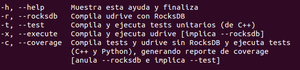

============================================================================================================
Compilación y ejecución
============================================================================================================

Tanto la compilación como la ejecución del Servidor de UDrive se pueden realizar de forma manual
o de forma automática.

Compilación y Ejecución de forma Manual (del servidor, los tests unitarios y el code coverage)
<<<<<<<<<<<<<<<<<<<<<<<<<<<<<<<<<<<<<<<<<<<<<<<<<<<<<<<<<<<<<<<<<<<<<<<<<<<<<<<<<<<<<<<<<<<<<<<<<<<<<<<<<<<<

Con ejecución inmediata
------------------------------------------------------------------------------------------------------------

Habiendo instalado previamente todas las dependencias necesarias, indicadas en la sección `Instalación y configuración <instalacion_y_configuracion.html>`_ , ejecutar el script ``build.sh`` con la opción *-h* desde la raíz del proyecto. Este comando desplagará las distintas opciones de compilación del *Servidor* de *UDrive*

	Opciones que desplega la opción *-h* del script *build.sh*

Sin ejecución inmediata
------------------------------------------------------------------------------------------------------------

Crear una carpeta ``build`` dentro de la raíz del proyecto. Dentro de esa carpeta, crear las carpetas ``files`` y ``db``.
Luego, desde allí ejecutar 

.. code-block:: bash

	cmake [-D<flag>=<ON|OFF>] ../
	make <target>

Donde los *flags* pueden ser:
 + *rocksdb* - usar bases de datos persistentes en vez de mapas (volátiles) en memoria
 + *test* - habilita target **unitTest**
 + *coverage* - realizar análisis de coverage (habilita targets **unitTest** y **coverage**).    Esta opción desactiva RocksDB y activa los tests unitarios. Prepara la compilación el servidor con mapas en memoria y de los tests unitarios.

Los *targets* pueden ser:
 + *udrive* - compila el servidor
 + *unitTests* - compila los tests unitarios
 + *coverage* - compila el servidor y los tests unitarios; ejecuta estos últimos y los de integración, guardando los resultados del análisis de coverage en la carpeta ``coverage`` dentro de la carpeta ``build``.

Compilación y Ejecución de forma automática con Docker (del servidor y los tests unitarios)
<<<<<<<<<<<<<<<<<<<<<<<<<<<<<<<<<<<<<<<<<<<<<<<<<<<<<<<<<<<<<<<<<<<<<<<<<<<<<<<<<<<<<<<<<<<<<<<<<<<<<<<<<<<<
Una vez que se tiene instalado Docker, tal como se indicada en la sección `Instalación y configuración <instalacion_y_configuracion.html>`_, copiar el archivo ``Dockerfile`` a una carpeta vacía. Desde esa carpeta, ejecutar:

.. code-block:: bash

	sudo docker build -t udrive .
	sudo docker run -it udrive

Estos dos comandos inicializan el entorno de Docker y compilan, ejecutan los test unitarios y finalmente lanzan el servidor de UDrive.

Para poder conectarse con el Servidor, desde otra consola ejecutar:

.. code-block:: bash

	sudo docker ps | grep udrive
	sudo docker inspect <containerID> | grep IPAddress

donde ``<containerID>`` es el ID del container obtenido en el primer comando. 

Finalmente con la IP obtenida en el último comando se podrá interactuar con el servidor (considerando que se lanza en el puerto 8080).

Para saber como interactuar con el Servidor ver el Manual de la API REST dentro de la Documentación Técnica del Servidor.
